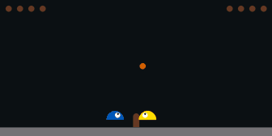
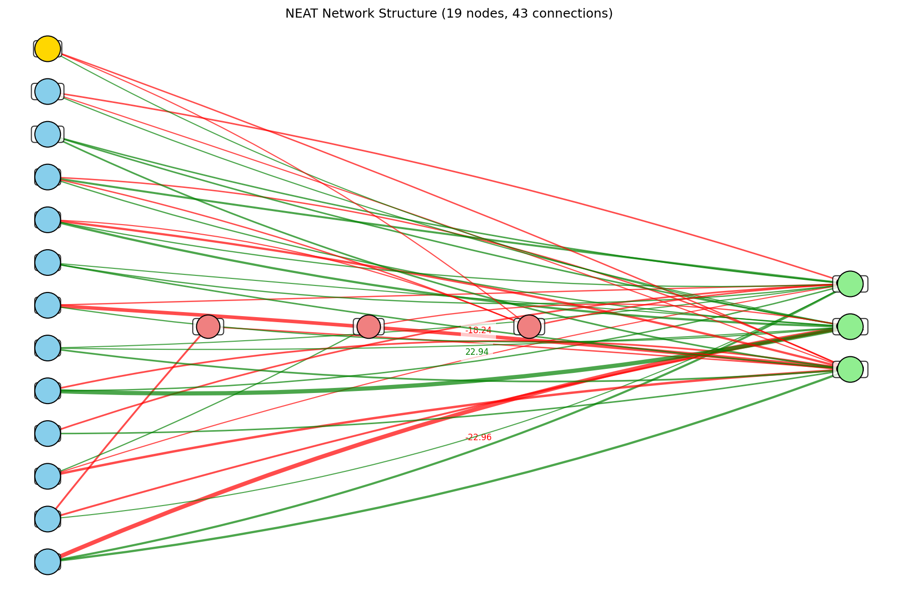

# SlimeVolley NEAT Implementation

An implementation of NeuroEvolution of Augmenting Topologies (NEAT) for the SlimeVolley environment in EvoJAX.



*A trained NEAT agent (yellow) playing against the built-in opponent (blue)*

## Overview

Slime Volleyball is a simple game where agents compete to get the ball to land on the opponent's side. NEAT evolves both neural network structure and weights simultaneously, discovering minimal yet effective architectures for this task.

## Running the NEAT Implementation

```shell
# Basic usage
python examples/train_slimevolley_neat.py

# With GPU acceleration
python examples/train_slimevolley_neat.py --gpu-id=0

# With custom parameters
python examples/train_slimevolley_neat.py --pop-size=50 --max-iter=1000
```

## Key Parameters

| Parameter | Description | Default |
|-----------|-------------|---------|
| `--pop-size` | Population size | 30 |
| `--max-nodes` | Max nodes in network | 30 |
| `--max-connections` | Max connections | 100 |
| `--max-iter` | Training iterations | 500 |
| `--conn-add-prob` | Connection addition probability | 0.15 |
| `--node-add-prob` | Node addition probability | 0.1 |
| `--weight-mutate-prob` | Weight mutation probability | 0.9 |

## How It Works

The NEAT implementation:

1. **Evolves Network Structure**: Starts with minimal networks and adds nodes/connections through evolution
2. **Uses Species**: Groups similar networks into species for protecting innovation
3. **Supports Multiple Activation Functions**: Networks can use ReLU, sigmoid, and tanh

Networks are trained to predict optimal actions based on the game state (ball position, velocities, etc.) using evolutionary algorithms rather than gradient-based learning.

## Output

After training, you'll find in the `./log/slimevolley_neat/` directory:

- **Network Visualization**: PNG showing the evolved neural network structure
- **Agent Gameplay**: GIF of the trained agent playing volleyball
- **Trained Model**: NPZ file with the best parameters

## Example Results

### Gameplay Evolution

The agent typically improves from random movements to strategic gameplay over hundreds of generations:

1. **Early Training**: Random or basic movements, frequently missing the ball
2. **Mid Training**: Basic ball-tracking and simple returns
3. **Late Training**: Strategic positioning and effective returns

### Neural Network Structure


*Example of an evolved neural network structure with the input nodes (blue), bias nodes (yellow), hidden nodes (red), and output nodes (green).*

The evolved networks typically develop an efficient structure with:
- Direct connections from key inputs to outputs
- A small number of hidden nodes for complex game situations
- Different activation functions for different computational needs

The visualization shows positive connections in green and negative in red, with line thickness representing connection strength.